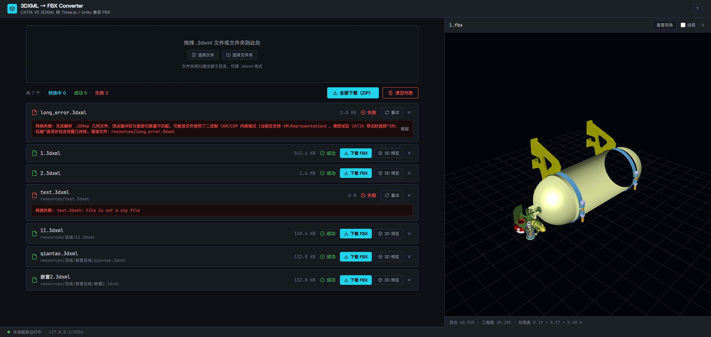

# 3DXML → FBX 转换工具

将 CATIA V5 导出的 **3DXML**（zip 压缩包）转换为 **FBX**，产物同时兼容：

- **Web 端 Three.js `THREE.FBXLoader`**
- **Unity FBX 导入器**

保留装配层级、多色材质、零错加载。默认输出已完成 USF=100 单位修补，无需为 Unity 单独导出第二份。

**三种使用形态**：① 本地 Web 界面（默认）；② 命令行（CLI）；③ 服务器部署（团队浏览器访问）。

---

## 目录

- [一、快速上手](#一快速上手)
- [二、环境要求（开发模式）](#二环境要求开发模式)
- [三、命令行用法](#三命令行用法)
- [四、输出说明](#四输出说明)
- [五、验证产物](#五验证产物)
- [六、总体架构](#六总体架构)
- [七、Web 界面](#七web-界面)
- [八、HTTP 接口](#八http-接口)
- [九、打包分发（Nuitka）](#九打包分发nuitka)
- [十、部署](#十部署)
- [十一、技术实现要点](#十一技术实现要点)
- [十二、调整朝向](#十二调整朝向不同模型可能不同)
- [十三、目录结构](#十三目录结构)
- [十四、已知限制](#十四已知限制)

---

## 一、快速上手

> **终端用户不需要读本文**——请直接看分发包内的 [SETUP.md](SETUP.md)（免安装上手指南）。本文是完整技术文档。

开发模式（需先完成「二、环境要求」的安装）：

```bash
# Web 界面模式（推荐）：启动本地服务并自动打开浏览器
python app.py

# 显式服务模式（指定端口、不弹浏览器）
python app.py serve --port 8000 --no-browser

# CLI 模式
python convert.py input.3dxml
```

页面/命令都会把 `.3dxml` 转为同名 `.fbx`，已完成 Unity 兼容 patch，直接用即可。

---

## 二、环境要求（开发模式）

| 项 | 要求 |
|---|---|
| Python | **3.13**（bpy 官方 wheel 仅发布 cp313，其他版本无法加载） |
| bpy 包 | 安装到本项目 `./vendor` 目录 |
| flask 包 | Web 界面模式需要，同样装到 `./vendor` |

> 核心转换脚本依赖 `bpy`（Blender Foundation 官方 PyPI 包），**无需安装 Blender**。`convert.py` 把 `./vendor` 注入 `sys.path` 后在进程内直接调用，无任何子进程。

### 首次安装依赖

```bash
# Windows
"C:/Users/<用户名>/AppData/Local/Programs/Python/Python313/python.exe" -m pip install bpy flask --target=./vendor

# Linux
python3.13 -m pip install bpy flask --target=./vendor
```

- 下载量约 350MB（主要是 bpy）。
- Windows 与 Linux 不能混用 `./vendor`，各系统需各自重装。

### 指定 Python 3.13 路径（可选）

若 `python` 默认不是 3.13，或装在非默认路径，编辑 `config.json`：

```json
{
  "python_path": "C:/Users/<用户名>/AppData/Local/Programs/Python/Python313/python.exe"
}
```

未配置时，`convert.py` 依次尝试 `PYTHON313` 环境变量、`PATH` 中的 `python3.13`、常见安装路径，找到后用 `os.execv` 自动切换到 3.13。

---

## 三、命令行用法

`app.py` 是统一入口，按参数分流：

```
app.py                          → Web 服务模式（默认 127.0.0.1:自动端口，自动开浏览器）
app.py serve [--host H] [--port P] [--no-browser]
                                → 显式服务模式；--host 0.0.0.0 为局域网模式
app.py <其他参数>                → CLI 模式（等价于 python convert.py）
```

CLI 参数（`python convert.py` 或 `python app.py` 均可）：

```bash
# 单文件：默认输出与输入同名
python convert.py input.3dxml

# 单文件：指定输出文件名
python convert.py input.3dxml output.fbx

# 批量：转换目录下所有 .3dxml，输出到同目录
python convert.py resources/

# 批量：转换目录下所有 .3dxml，输出到指定目录（不存在自动创建）
python convert.py resources/ -o output_fbx

# 批量：递归扫描子目录
python convert.py resources -r -o output_fbx

# 批量：单个失败继续
python convert.py resources/ -o output_fbx --continue-on-error

# 转换 + Blender 回读验证
python convert.py input.3dxml --verify

# 跳过 Unity 兼容 patch（极少需要）
python convert.py input.3dxml --no-patch
```

| 参数 | 说明 | 默认值 |
|---|---|---|
| `input` | 输入 `.3dxml` 文件路径或目录 | 必填 |
| `output` | 单文件模式下输出 `.fbx` 路径 | 与输入同名 |
| `-o, --output-dir` | 批量模式下指定输出目录 | 与输入同目录 |
| `-r, --recursive` | 递归扫描子目录 | 仅当前目录 |
| `--no-patch` | 跳过 USF=100 patch | 默认启用 patch |
| `--verify` | 转换后回读验证 | 默认不验证 |
| `--continue-on-error` | 批量模式单个失败后继续 | 遇失败即停止 |

退出码：成功 0；有失败 1。批量模式结束打印 `[summary] 成功 N 个，失败 M 个`。

执行流程（每次转换自动完成）：

1. 进程内调用 `bpy` 导出中间 FBX；
2. `diagnose_fbx_units.patch` 将 `UnitScaleFactor` 设为 `100.0`（Unity 视觉尺寸与 Three.js 一致）；
3. 若带 `--verify`，再用 bpy 回读校验结构/几何/材质。

---

## 四、输出说明

- **格式**：binary FBX 7.4（FBXLoader 友好）
- **坐标系**：Y-up（对应 CAD Exchanger 的 "Use OY as Up axis"）
- **单位**：3DXML 原始 mm → 米（÷1000），根节点 `scale≈1`、坐标为米级小值；根节点 `position` = 模型几何中心（包围盒中心上提），可直接用于定位
- **结构**：`Group`(装配根) → 子 `Group`(子装配) / `Mesh`(零件)，实例已展开
- **材质**：每个面的内联 RGBA 颜色 → Principled BSDF，按颜色分多材质槽
- **Unity 兼容**：FBX 头 `UnitScaleFactor = 100.0`，Unity 按 `USF/100` 缩放后视觉尺寸与 Three.js 一致

---

## 五、验证产物

### 1. bpy 回读（结构/几何/材质核对）

```bash
python convert.py input.3dxml --verify
```

打印装配树、每个 Mesh 的顶点/材质数、材质颜色样本、世界包围盒。

### 2. THREE.FBXLoader 浏览器实测

```bash
python -m http.server 8000
# 浏览器打开：
http://127.0.0.1:8000/tests/test_fbx_loader.html?model=../input.fbx
```

页面用 FBXLoader 加载并渲染，左上角输出 mesh 数、三角面数、包围盒。`?model=` 必须提供。

### 3. Web 界面内验证

Web 模式的「3D 预览」按钮在页面内直接渲染转换产物（与 FBXLoader 同一加载路径），并显示顶点数/三角面数/包围盒尺寸。

---

## 六、总体架构

```
                        ┌────────────────────────────────────────┐
                        │              app.py（统一入口）          │
                        └───────┬───────────────┬────────────────┘
                          无参数/serve         │          其余参数
                                ▼             ▼                ▼
                        ┌──────────────┐ ┌──────────┐ ┌──────────────────┐
                        │  server.py   │ │ (同左)    │ │   convert.py     │
                        │  Flask 服务  │ │          │ │   argparse CLI   │
                        └──────┬───────┘ └──────────┘ └────────┬─────────┘
                               │  POST /convert（全局串行锁）    │ convert_one()
                               ▼                               ▼
                        ┌──────────────────────────────────────────────┐
                        │           convert.convert_one()              │
                        │  ① converter.convert_3dxml_to_fbx.convert()  │ ← bpy 导出中间 FBX
                        │  ② converter.diagnose_fbx_units.patch()      │ ← USF=100（Unity 兼容）
                        │  ③ converter.verify_fbx.verify()（可选）      │ ← bpy 回读验证
                        └──────────────────────────────────────────────┘
```

### 关键架构约定

1. **进程内调用，无子进程**：转换/验证都是同进程函数调用。`convert_3dxml_to_fbx.convert()` 开头重置全部 module-level globals（`TMPDIR/REFERENCES/INSTANCES/PARSE_CACHE/NODE_COUNT/MESH_COUNT`），批量/多次调用互不污染（`PARSE_CACHE` 不重置会读到上一文件的缓存几何）。**改回 Blender 子进程会破坏整个工作流，勿改。**
2. **并发模型**：bpy 非线程安全——Web 模式下所有转换经 `server.CONVERT_LOCK` 全局串行；前端也逐个提交，天然排队。Flask `threaded=True` 只保证静态资源/健康检查不阻塞。
3. **会话文件生命周期**：`server.py` 启动时 `tempfile.mkdtemp(prefix="3dxml_fbx_")` 建会话目录；上传的 `.3dxml` 与产物 `.fbx` 都在其下按任务 id 分目录存放；进程退出 `atexit` 整体删除。强杀会残留在系统 Temp（系统磁盘清理兜底），**不落任何持久位置**。
4. **FROZEN 守卫**：`convert.py` 顶部 `FROZEN = getattr(sys, "frozen", False) or "__compiled__" in globals()`。Nuitka 冻结状态下跳过 `ensure_python313()` 与 `./vendor` sys.path 注入（解释器与 bpy 已编译进产物）。**移除该守卫会让 exe 在用户机器上找 Python 3.13。**
5. **stdout 双包装陷阱**：`app.py`/`convert.py`/`server.py` 都做 stdout UTF-8 包装，必须先查 `sys.stdout.encoding == 'utf-8'` 再包——重复包装会让旧包装器被 GC 时关闭底层流（`ValueError: I/O operation on closed file`）。

---

## 七、Web 界面

深色科技风单页（`web/`），按 Pixso 设计稿 DSL **像素级还原**。



### 文件构成

| 文件 | 作用 |
|---|---|
| `index.html` | 页面骨架 + importmap（`three` → `/vendor/three/...`） |
| `app.css` | 全部样式（色板/间距/字号/圆角均取设计稿 DSL 原始值） |
| `app.js` | 交互：拖拽/选择文件与文件夹、任务队列（逐个串行 POST `/convert`）、状态渲染、下载/ZIP、Toast、确认对话框、预览抽屉控制 |
| `preview.js` | Three.js 预览模块（按需 `import()` 懒加载）：FBXLoader 渲染、OrbitControls、网格地面、线框切换、重置视角、顶点/三角面/包围盒统计 |
| `assets/icons/` | 设计稿导出的 SVG 图标（颜色已按状态烘焙，直接 `` 引用） |
| `assets/fonts/` | JetBrains Mono TTF（`@font-face`；文件名/路径/尺寸等数据文字） |
| `vendor/three/` | 本地化 three@0.169 + FBXLoader + OrbitControls + NURBS + fflate（离线可用） |

### 功能要点

- **两种输入**：`<input multiple>` 选文件 / `<input webkitdirectory>` 选文件夹；拖拽经 `webkitGetAsEntry` 递归遍历目录。只收 `.3dxml`。
- **任务四态**：排队中 / 转换中（不定态进度条——服务端拿不到 bpy 真实进度）/ 成功（下载 FBX、3D 预览）/ 失败（错误条 + 展开详情 + 重试）。
- **文件夹任务**显示相对路径；ZIP 打包保持目录结构（UTF-8 文件名）。
- **预览抽屉**：右侧滑出（约 48vw），深底 + 浅网格地面，鼠标旋转/缩放/平移。
- **字体栈**：中文 `"PingFang SC", "Microsoft YaHei"`；数据 `"JetBrains Mono", "PingFang SC", "Microsoft YaHei"`（拉丁走 Mono，中文按字符回退）。
- **同源部署**：页面与接口同一 Flask 发出，**无跨域**，未引入任何 CORS 头。

---

## 八、HTTP 接口

`server.py`（Flask）暴露：

| 端点 | 方法 | 说明 |
|---|---|---|
| `/` | GET | 返回 `web/index.html` |
| `/<path>` | GET | `web/` 下静态资源（app.js/app.css/assets/...），`send_from_directory` 防目录穿越 |
| `/vendor/<path>` | GET | three.js 本地化依赖 |
| `/convert` | POST | multipart 上传（字段 `file`，可选 `relpath`）→ 串行转换 → `{ok, id, name, size}` 或 `{ok:false, error}` |
| `/file/<id>` | GET | 下载/预览对应任务的 `.fbx` |
| `/zip` | POST | `{ids:[...]}` → 按 `relpath`（保持目录结构）打包 zip 返回 |
| `/health` | GET | 存活检查 `{ok: true}` |

会话状态全在内存（任务 id → 文件路径映射），进程退出即清空。不设 `MAX_CONTENT_LENGTH`（本地大文件）。

---

## 九、打包分发（Nuitka）

```bash
python tools/build.py
```

Nuitka `--standalone` 编译，产出自包含 `dist/`（约 1GB）：内置 Python 3.13 运行时 + bpy + flask + `web/` 界面 + `SETUP.md` 用户手册，**项目代码全部编译为机器码，无 .py 源码**。压缩整个文件夹即可分发，用户 Windows 10+ 解压双击 `converter.exe` 即用。

### 构建参数要点

| 参数 | 作用 |
|---|---|
| `--include-package=bpy --include-package-data=bpy` | bpy 二进制扩展包（`__init__.pyd` + 全部 DLL + `5.1/` 数据目录） |
| `--include-package=numpy flask` | 二进制 pyd 的 import 无法静态分析，显式带上 |
| `--include-module=convert,server --include-package=converter` | 本项目模块（函数级 import，显式声明防漏） |
| `--include-data-dir=web=web` | 界面与 three.js 资源（纯拷贝，**改 web/ 后覆盖 dist/web/ 即可，无需重新编译**） |
| `--msvc=latest` | C 编译器（需 VS 2022 / Build Tools） |

### 构建机要求

Windows 10+、Python 3.13、MSVC、`./vendor` 已装 bpy；flask/nuitka 缺失时 build.py 自动安装到 `./vendor`。首次构建 10–30 分钟（C 编译），后续有 `build/` 缓存明显加快。

### `build/` 与 `dist/` 的区别

- `build/`（~600MB）：Nuitka **编译中间产物**（转译 C 源码、`.obj`），仅作增量编译缓存，可删（下次构建变慢）；
- `dist/`（~1GB）：**最终分发包**，唯一需要发给用户的东西。

### 单文件 exe（onefile）为何不用

`--onefile` 每次启动要把 ~1GB 解压到临时目录（几十秒启动延迟 + 杀软高误报 + 临时盘双倍占用）。1GB 体量下文件夹方案是唯一合理选择；需要"单文件分发"形态时用 zip 或 NSIS/Inno Setup 安装包。

### Win7 限制

Python 3.13 + bpy 5.x 要求 **Windows 10+**，exe 无法在 Win7 运行。老系统用户走局域网模式：一台 Win10+ 机器 `converter.exe serve --host 0.0.0.0`，Win7 机器浏览器访问。

---

## 十、部署

服务器部署（Windows exe / Linux 源码 + systemd + nginx 注意点）详见 [SETUP.md](SETUP.md)「二、部署到服务器」。要点回顾：

- `converter.exe serve --host 0.0.0.0 --port 8000 --no-browser`（Windows 服务器零环境）；
- Linux 需 Python 3.13 + `pip install bpy flask --target=./vendor` + 无头图形库（`libgl1 libxi6 libxxf86vm1 libxfixes3 libxrender1`）；
- 并发自动排队（全局串行锁）；上传/产物在临时目录，进程退出自删；
- 公网暴露必须在 nginx 层加鉴权（服务本身无登录）。

---

## 十一、技术实现要点

| 维度 | 实现 |
|---|---|
| 几何解析 | `.3DRep` 的 `XMLRepresentation`/`PolygonalRepType`：`VertexBuffer.Positions`/`Normals` + `Face` 的 `triangles`/`strips`/`fans`（全部三角化，strips 按奇偶位翻转缠绕） |
| 装配树 | `Reference3D`/`Instance3D` 递归**展开实例**（同一零件多次实例化时，每个实例生成独立节点 + 独立 mesh，因 FBXLoader 不支持实例化引用） |
| 变换矩阵 | `RelativeMatrix` **列优先**（OpenGL/GLC_lib 约定）：前 9 个填旋转（按列），后 3 个为平移；语义为 local→parent，直接作 `matrix_local` |
| Up 轴 | **Y-up**（Blender 内用原始坐标，导出 `axis_up='Y'`） |
| 单位 | mm → 米；Blender 场景 `scale_length=0.01` + `apply_unit_scale=True` + `global_scale=1.0`，使根 `scale≈1`、顶点/位移为米级 |
| Unity 兼容 | 导出后 patch `UnitScaleFactor`/`OriginalUnitScaleFactor` 为 `100.0`；Unity 按 `USF/100` 缩放，视觉尺寸与 Three.js 一致 |
| 节点精简 | 跳过无几何的空叶子节点（如空 `.3DRep` 引发的冗余 Empty） |
| 材质 | 因 3DXML 缺「材质库→零件」绑定关系，用每个 `Face` 的内联 RGBA 纯色降级 |
| LOD | 每个 `PolygonalRepType` 优先取直接子 `<Faces>`（最高精度），缺失时取 `accuracy` 最小的 `PolygonalLOD` |

转换流水线（`converter/convert_3dxml_to_fbx.py`，单文件 5 阶段）：

1. **解压 + 定位**：`zipfile` 解压 3DXML，读 `Manifest.xml` 的 `<Root>` 得主结构文件；
2. **解析产品结构**（`parse_structure`）：`.3DRep` 几何文件经 `InstanceRep` 桥接到 Reference3D（`ReferenceRep` 无 `<IsAggregatedBy>`，必须走 `InstanceRep.IsAggregatedBy` + `IsInstanceOf`）；
3. **解析几何**（`parse_rep_file`→`parse_cached`）：rep 内所有 `PolygonalRepType` 合并为单 mesh（索引加偏移量）；
4. **构建场景**（`expand`）：递归展开实例树（`matrix_parent_inverse = Identity` + `matrix_basis = relative_matrix`）；
5. **导出 FBX**（`export_fbx`）：版本兼容构造 kwargs。

几何三角化（`expand_face`）：`strips` 段内第 i 个三角形按奇偶位翻转缠绕保证法线一致；`fans` 首点为中心。**改这里会批量翻转法线。**

---

## 十二、调整朝向（不同模型可能不同）

若默认朝向不符合预期，编辑 `converter/convert_3dxml_to_fbx.py` 的 `export_fbx()`：

```python
axis_forward='-Z',   # 可选: '-Z' / 'Y' / '-Y' / 'X' ...
axis_up='Y',         # 可选: 'Y' / 'Z'   ← CAD/3DXML 常见为 Y-up 或 Z-up
```

| 现象 | 调整 |
|---|---|
| 模型竖直立起来 | 改 `axis_up`（Y↔Z） |
| 模型侧躺/翻转 | 改 `axis_forward` |
| 左右镜像 | 调 `axis_forward` 正负 |

> 矩阵旋转约定（行/列优先）若需切换，编辑 `relmatrix_to_mat4()`：列优先用 `(v0,v3,v6...)`，行优先用 `(v0,v1,v2...)`。

---

## 十三、目录结构

```
3dxml-converter/
├── app.py                    # 统一入口（无参=Web 服务；serve=服务模式；其余=CLI）
├── convert.py                # CLI 主逻辑（export + patch + verify；含 FROZEN 守卫）
├── server.py                 # Flask 服务（接口 + 静态托管 + 转换串行锁 + 会话临时目录）
├── config.json               # Python 3.13 路径配置（仅开发模式）
├── converter/                # 运行时包
│   ├── convert_3dxml_to_fbx.py   # 主转换脚本（5 阶段流水线）
│   ├── diagnose_fbx_units.py     # FBX 单位元数据读写/修补（USF=100）
│   └── verify_fbx.py             # bpy 回读验证
├── web/                      # Web 界面
│   ├── index.html / app.css / app.js / preview.js
│   ├── assets/               # 设计稿 SVG 图标 + JetBrains Mono 字体
│   └── vendor/three/         # 本地化 three@0.169 全套依赖
├── tools/
│   └── build.py              # Nuitka 一键构建 dist/
├── tests/                    # 开发/回归
│   ├── verify_export_scale.py    # 导出单位配置回归
│   ├── compare_fbx.py            # 裸 FBX 二进制对比
│   └── test_fbx_loader.html      # FBXLoader 浏览器测试页
├── docs/
│   └── web-ui.png  # Web 界面截图（README 展示用）
├── README.md                 # 本文（技术文档，不进分发包）
├── SETUP.md                  # 用户手册（唯一随 dist 分发的文档）
├── resources/                # 示例输入（不随仓库提交）
├── vendor/                   # bpy/flask/nuitka 依赖（不随仓库提交）
├── build/                    # Nuitka 编译中间产物（不随仓库提交，可删）
└── dist/                     # 最终分发包（不随仓库提交）
```

---

## 十四、已知限制

1. **仅支持 XML 型 `.3DRep`**：二进制型 `.3DRep`（CATIA CGR/CGM 内核变体）为达索私有格式，无开源解析方案。
2. **材质库无法精确绑定**：`material_*` 等 OSM 物理材质定义存在，但 3DXML 中缺到具体零件的绑定节点 → 用面内联纯色降级（颜色准确，丢失反射率/折射率等物理参数）。
3. **单位**：原始为 mm，脚本自动换算为**米**（÷1000），导出 `scale≈1`、坐标为米级小值。根节点 `position` = 模型几何中心。`scale` 可能是 `0.9999999999999999`（Blender 浮点精度，等同 1），如需严格 `1` 可加载后 `fbx.scale.set(1,1,1)` 归一化。
4. **空零件**：源 `.3DRep` 为空（`<Root/>`）的零件（如某些标准件）不会生成几何节点。
5. **转换进度**：Web 界面进度条为不定态动画——bpy 导出无进度回调，无法显示真实百分比。
6. **分发平台**：Nuitka 产物仅 Windows x64；Linux/macOS 用户走源码运行或服务器部署。
