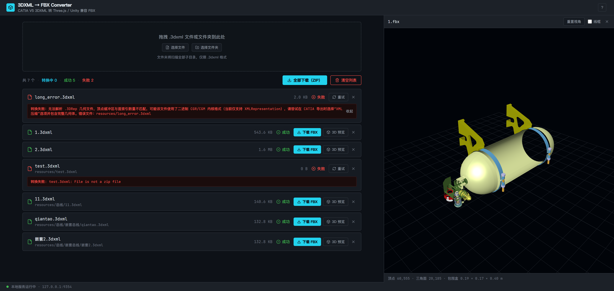

# 3DXML → FBX 转换工具

将 CATIA V5 导出的 **3DXML** 转换为 **FBX**，产物同时兼容 **Three.js FBXLoader** 与 **Unity**。保留装配层级与多色材质，内置 Unity 单位兼容处理。



## 方式一：下载使用（推荐，Windows 10+）

1. 从 [GitHub Releases](https://github.com/z1130/convert_3dxml_to_fbx/releases) 下载 `3dxml-converter-windows-x64.zip`；
2. 解压到任意目录，双击 `converter.exe`（自动打开浏览器转换页面）；
3. 拖入 `.3dxml` 文件或整个文件夹 → 自动转换 → 下载 FBX。

无需安装 Python / Blender，解压即用、离线可用。命令行批处理、局域网多人共用、服务器部署见 [docs/SETUP.md](docs/SETUP.md)。

## 方式二：源码运行

要求 **Python 3.13**（bpy wheel 仅发布 cp313），Windows / Linux 均可：

```bash
# 获取源码（二选一）：
#   a) 从 Releases 页面下载 Source code (zip)，解压后进入目录
#   b) git clone https://github.com/z1130/convert_3dxml_to_fbx.git && cd convert_3dxml_to_fbx

python3.13 -m pip install -r requirements.txt --target=./vendor   # 约 350MB

python app.py                  # Web 界面模式（自动打开浏览器）
python convert.py input.3dxml  # CLI 模式：单文件/批量转换
```

`python` 默认不是 3.13 时会自动查找并切换解释器；找不到时编辑 `config.json` 指定 `python_path`。

## 文档导航

| 文档 | 内容 |
|---|---|
| [docs/SETUP.md](docs/SETUP.md) | 使用手册（随分发包附带）：页面操作 / 命令行 / 局域网共用 / 服务器部署 / 常见问题 |
| [docs/DEVELOPMENT.md](docs/DEVELOPMENT.md) | 技术文档：总体架构、CLI 全参数、HTTP 接口、Nuitka 打包、CI 发布、技术实现要点、已知限制 |

> 已知限制：仅支持 XML 型 `.3DRep`（二进制 CGR/CGM 为达索私有格式，无开源解析方案）。
